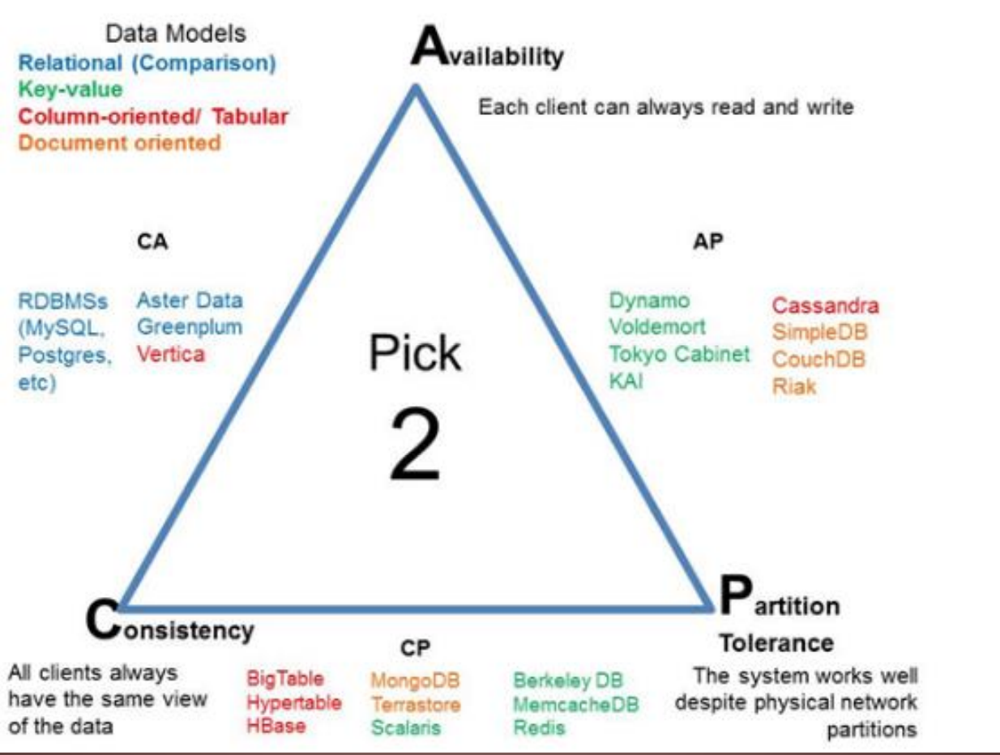
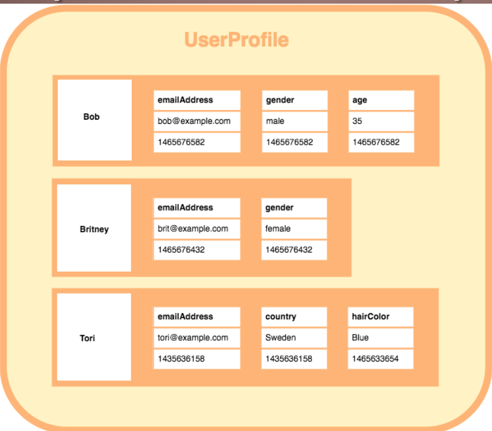
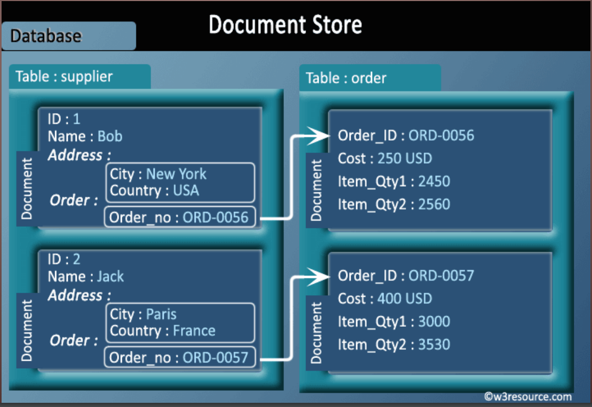
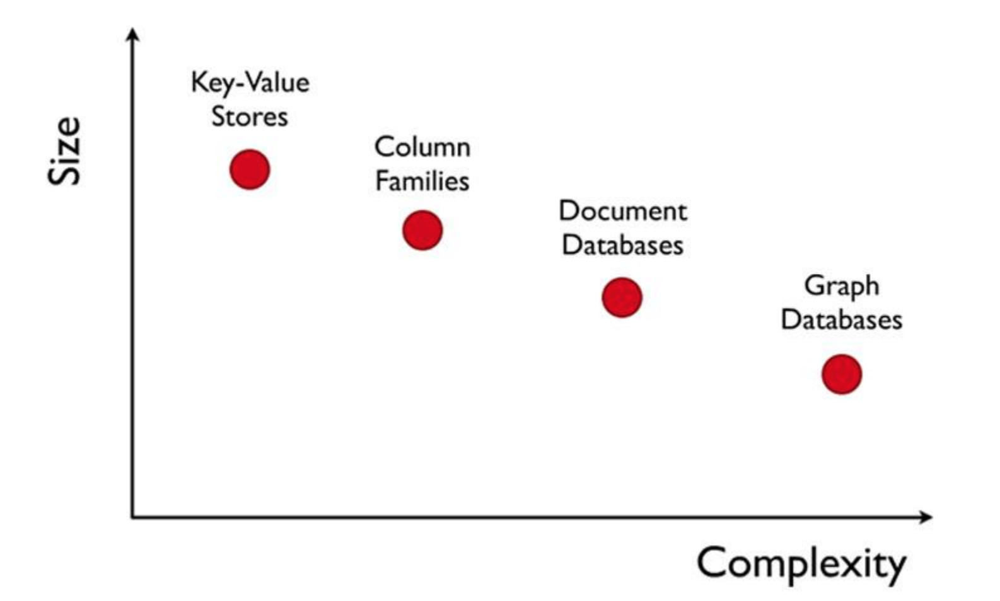
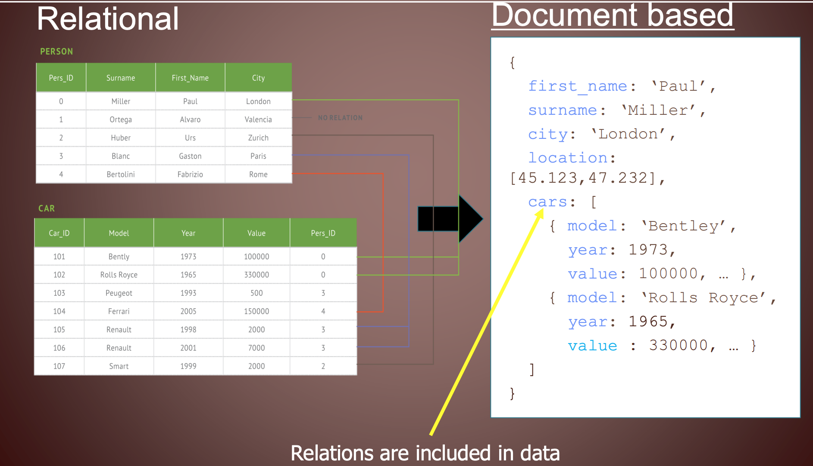
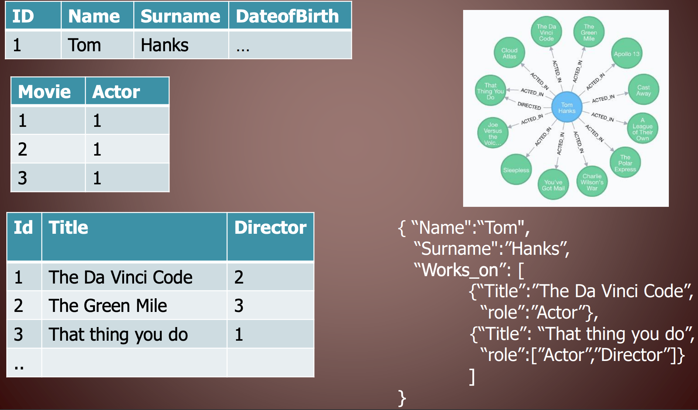

# NoSQL
Maurino 

## Perchè SI al modello relazionale

Dal principio dei nostri studi si studia il modello realzionale perchè è un modello che funziona molto bene. E' un modello di oltre 50 anni (1970), molto vecchio.

Garantiscono che l'insieme di operazioni scrittura/lettura avvengano in modo consistente e rispettando grazie alle proprietà ACID.

## Perchè NO al sistema relazionale
Introdotto e diffuso da IBM.

Lo schema è rigido
* un attributo <-> un valore
* non compatibile con i moderni linguaggi di programmazione
* minimizzazione dei valori (mai replicare i dati nel modello relazionale, epoca in cui pochi Kb valevano oro, quindi nel realzionale è grave errore replicare dati)
* non supportano i loop in data (dopo)

RDBMS (software che gestisce DB relazionali)
* Difficile modificare tabelle
* Non è scalabile (difficile scalare, aggiungere macchine, dischi ecc. Scale in e scale out)

La scalabilità in ogni caso ha un limite (es. di facebook che non riesce, con un modello relazionale, a stare dietro alle richieste)

Le tabelle di join tendono a far esplodere il numero di tabelle. Il SIFA della nostra università ha 5.000 tabelle (e non è il db completo dell'università)

## Not Only SQL - NoSQL

Google, Facebook, Amazon sono i pionieri delle tecnologie NoSQL. Non sono aziende che vendono tecnologie, bensì vendono servizi e usano la tecnologia. 

I loro sistemi di DB sono open source. Perchè? Beh perchè tanto non vendendo tecnologia, sanno che i concorrenti non hanno i loro dati e se anche implementassero i loro sistemi non avrebbero i vantaggi imprenditoriali del caso. 

Ma NoSQL serve solo ai grandi? No.

Per *esempio* nel database relazionale se definisco un modello e poi devo aggiungere un attributo devo prima modificare il modello, se pocco, e poi cambiare i dati.
In NoSQL non c'è un modello stretto: è basato sui dati che vengono inseriti (vedremo dopo). Tutti i modelli NoSQL assumono the open world assumption.

Altro *esempio* nel modello relazionale se devo rappresnetare i numeri di telefono di una persona, e questa ha più numeri? Devo avere una tabella di join, scomoda, brutta.

Ma come garantisco, in una rete **distribuita di computer** queste proprietà?
* Consistenza
* Disponobilità
* Partition tolleracne (continuo ad operare anche se ho dei fallimenti)
  
Secondo una congettura che non ho capito da dove arrivi, non è possibile soddisfare tutte e 3 queste proprietà ma solo 2 alla volta.

Per *esempio*, Facebook: mi importa molto della Disponibilità e di Partition tollerance, della consistenza mi importa meno (non mi interessa che tutti vedano in real time quello che scrivo in un post se anche il mio messaggio arriva sul server USA con qualche minuto di ritardo non è grave). La **consistenza** non è sempre la proprietà fondamentale. Per Facebook è meglio rispondere con qualcosa di non aggiornato che non rispondere proprio.

## Proprietà BASE (equivalente dell'ACID ma per NoSQL)
BASE

* Basic Availability: fulfill request, even in partial consistency.
* Soft State: abandon the consistency requirements of the ACID model
pretty much completely
* Eventual Consistency: at some point in the future, data will
converge to a consistent state; delayed consistency, as opposed to
immediate consistency of the ACID properties.
    * purely a liveness guarantee (reads eventually return the requested
value); but
    * does not make safety guarantees, i.e.,
    * an eventually consistent system can return any value before it
converges

## Modelli NoSQL

* Key-Value Stores
* Column Family Stores
* Document Databases
* Graph Databases
* RDF databases as well as Tuple stores

### Key Value

(Dynamo, Voldemrt, redis, riak.... (google))

Modello in cui esiste una chiave (che è l'unico oggetto interrogabile) e un valore.

Il mapping chiave-valore è supportato da meccanismi di hash per massimizzare le performance.

### Wide Column Value
(BigTable, Cassandra, HBase)

La chiave punta a colonne multiple, che possono esserci o non esserci.

Questa è molto comoda perchè se non ho il valore di una colonna non la metto. Non devo usare NULL o undefined o cose che poi mi creano casini con le query. Se lo ho lo metto, se non lo ho non lo metto.

Non c'è uno schema preciso da dover rispettare.

Il codice sotto è il timestamp di quando il dato è stato inserito/modificato. Questo è il modello più vicino al database relazionale classico SQL.

### Document Based
(CouchDB, MongoDB)

Si basano sul concetto di documento, che può contenere un chiave-valore o un altro documento.

* I documenti sono indirizzati nel db tramite una chiave unica
* Ricerca nei documenti

Evito l'operazione brutta e costosa di JOIN tra le tabelle, perchè i dati sono **fisicamente attaccati insieme**, in un albero.

Si bello, ma occupo un macello di spazio se devo replicare le cose a differenza del modello relazionale -> Non mi interessa, oggi, **lo spazio non costa** meglio andare veloci.

### Graph store

(Neo4J, FlockDB, GraphBase, InfoGrip)

Graph Databases sono costruiti da nodi e relazioni fra nodi (archi).

*I nodi hanno proprietà
    * Nodes rappresentano entità (e.g. "Bob" or "Alice").
    * Proprietà sono informazioni pertinenti ai nodi (e. g.età:18).
* I graph DBs non scalano bene (a differenza degli altri, che si basano comunque su una cbiave e quindi scalano bene (ovvero non posso distribuire in modo efficente i dati su un sistema distribuito e fare interrogazioni efficenti))

Non è scalabile, ergo va bene per volumi non troppo esagerati.

## Comparazioni

Stesssa identica informazione rappresentata in modi diversi:

Ma se le due tabelle hanno campi diversi, tipo "Persona" e l'latro "PersonID"? Il relazionale non funziona, devo mantenere integre le chiavi, aggiornarle in parallelo se devo modificarle, sbatti.

Stessa cosa, scritta in tre modi diversi: relazionale, document based, graph

Il passaggio da un modello all'altro è possibile in modo abbastanza facile. Per certe applicazioni, il NoSQL risulta più comodo da usare e da interrogare.