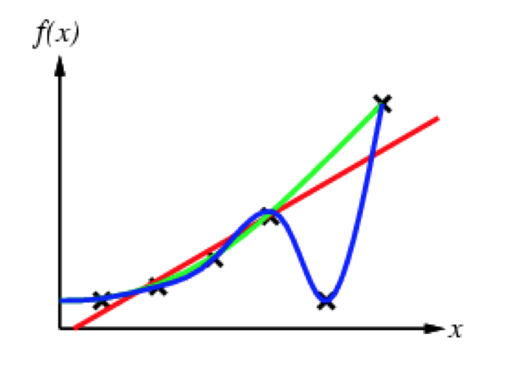

# Machine Learning
* Mauri
## Introduzione

### Definizioni di Machine Learnng
L'apprendimento denota cambiamenti nel sistema che sono *adattivi* ovvero consentono al sistema di effettuare la stessa operazione a partire dalla stessa popolazione in modo sempre più efficente nel tempo.

Processo di acquisizione in assenza di programmazione esplicita

Svilippo di un programma per effettuare operazioni su delle informazioni senza dare esplicita descrizione del programma

### Gli elementi base
 **Apprendere** = Migliorare rispetto a una  data misura la capacità  di esecuzione di un certo compito, attraverso l’esperienza

* T -> Task: compito da apprendere
* P -> Performance: misura di bontà su come apprendiamo (abbiamo appreso)
* E -> Experience: facciamo esperienza
  

* Leaner -> Colui che impara da esempi in modo automatico, quindi nel seguito, un algoritmo o un programma
* Trainer -> A volte parleremo di trainer riferendosi ad un modulo che fornisce l’esperienza al learner (dataset)

Il **compito T** è più facile da apprendere attraverso esempi piuttosto che codificare la conoscenza o dfeinire alcuni compiti. L'ambiente può cambiare, ed è più semplice presentare nuovi esempi piuttosto che riprogrammare tutto.

*esempi vari*
* Identify the numbers in a handwritten ZIP code, from a digitized image
* Estimate the amount of glucose in the blood of a diabetic person, from the infrared absorption spectrum of that person’s blood
* email spam

*esempio: Email Spam*

se sono presenti certe parole in una certa percentuale metto la mail in spam.

* Faso negativo, alla peggio ricevo l'email di spam (accettabile).
* Falso positivo, non ricevo l'email (questo è grave).

*esempio: diagnosi medica*
* Falso negativo, non ho un tumore ma la diagnosi è positiva (sticazzi)
* Falso positivo, ho un tumore ma la diagnosi è negativa (sticazzi)

*esempio: riconosicmento facciale*

* Cambiano gli elementi ambientali, la posa, l'invecchiamento, la barba, gli occhiali ecc. 
* esempio di campo in cui è importante il machine learning

## Inductive learning

Imparare una funzione dagli esempi. 

* $f$ è la funzione target
* Un esempio è la coppia (x, f(x))

Problema: trovare una funzione $h$ (ipotesi) tale che $f \sim h$. 

Modello semplicissimo: ignora la conoscenza pregressa, assume che ci siano degli esempi forniti.

C'è da scegliere il modello di "learning" migliore. La curva/retta che fitta meglio senza overfittare (ovvero "imparara a memoria" i dati, e non è poi in gradi di applicare la funzione a dati diversi)

(*esempio* blu non va bene)

Ocamm's razor: è preferibile scegliere l'ipotesi più semplice che è consistente con i dati

L’esperienza (gli esempi) deve essere presentata a learner in maniera casuale. Non è sempre così poichè non si dispone sempre di tutti gli esempi.

### Formulazione di un problema di apprendimento automatico

* Formulazione del concetto da apprendere
    * Che tipo di informazione vogliamo apprendere ?
    * Come rappresentiamo questa informazione ?
* 2° Formulazione dell’esperienza
    * Insieme di esempi che consentono l’apprendimento
* 3° Formulazione della performance
    * Data la rappresentazione dell’informazione da apprendere e gli esempi come esperienza la formulazione della misura scelta per valutare la capacità del learner

### Metodi di appredimento

**Apprendere espressioni simboliche:**
* Alberi di decisione
* Regole di associazione
  
**Apprendere funzioni di probabilità:**
* Bayesian learning
* Hidden Markov models

**Apprendere funzioni algebriche:**
* Gradient descent (neural networks)
* Support Vector Machines

### Altra classificazione dei metodi di appredimento

**In base all’informazione (esperienza) a disposizione:**
* **Supervisionato**
    * C’e’ un “insegnante” che comunica l’output corretto. E’ come se si supponesse l’esistenza di un trainer (oracolo) che, per ogni input fornito al sistema, dia la risposta corretta.Per ogni input xi l’ipotetico trainer fornisce il risultato corretto yi
* **Non supervisionato**
    * Riconoscere “schemi” nell’input senza indicazioni sui valori in uscita. L’esperienza di apprendimento è rappresentata da esempi “non classificati”: non esiste un trainer che fornisce le risposte corrette agli input. Cosa si apprende? Regolarità, una strutturazione insita nello spazio degli input. 
    Il clustering è un tipico problema di apprendimento non supervisionato
    E’ difficile trovare misure di prestazione. Spesso, sono date valutazioni soggettive da parte di esperti umani.

* **Con rinforzo**
    * Più generale, apprendere sulla base della risposta dell’ambiente alle proprie azioni. Il learner interagisce con l’ambiente e riceve una ricompensa (es: numerica) positiva o negativa (es: se un robot fa goal il “peso”  della sequenza di azioni che lo ha portato a fare goal viene aumentato) 
    Cosa si apprende? Una strategia di comportamento (un “piano” o sequenza di azioni)
    Misura della prestazione: si cerca di massimizzare “a lungo termine” la ricompensa complessivamente ottenuta

**In base al controllo che il learner ha dell’esperienza:**
* **Apprendimento passivo**
    * L’apprendista può apprendere solo dai dati che vengono messi a disposizione (E)
* **Apprendimento attivo**
    * L’apprendista può fare domande ed esperimenti (es. un web advisor può chiedere esplicitamente all’utente di valutare il suo gradimento sull’operato dell’advisor). Problema: come limitare l’intrusività dell’apprendista in modo ottimale?

