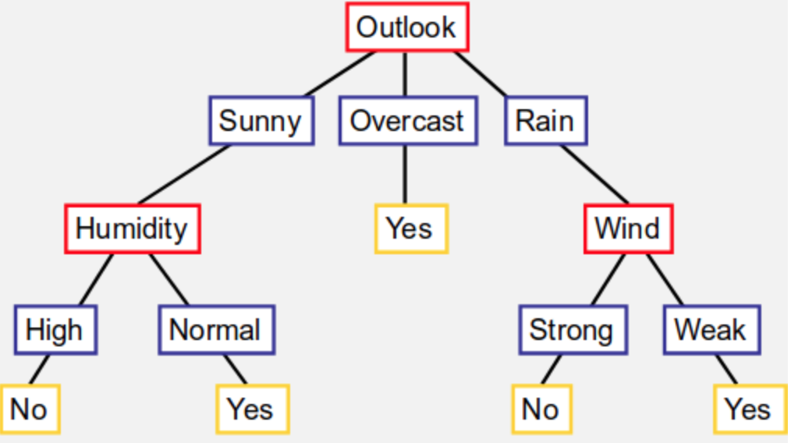

Possiamo ora analizzare pro e i contro dell’algoritmo Find-S precedentemente presentato:

### Pro
Lo spazio delle ipotesi (H) è descritto da una congiunzione di attributi. L’algoritmo mostra in output l’ipotesi più specifica in H che è consistente con gli esempi positivi nel training set; la funzione messa in output dall’algoritmo risulterà essere consistente anche con i target negativi presenti in H.

### Contro
Non si può dire se l’allievo (il programma) sta effettivamente convergendo verso il concetto target (la funzione c), nel senso: non sappiamo dire se è in grado di determinare che ha trovato l’unica ipotesi consistente con i dati presenti nel training set, c’è ne possono essere altre, perché limitarsi solo a una?. 
Non possiamo dire quando il dato di esempio (training example) è consistente. Inoltre la scelta dello spazio di ipotesi risulta essere molto limitativa, nel caso in cui avessi un attributo X con tre possibili valori di cui due vanno bene e uno mi rende negativa la risposta, non ho gli strumenti per identificare e descrivere questa situazione.
Find-S ci permette solo di dire, dato un certo attributo:”mi va bene questo valore, non mi va bene questo valore, mi vanno bene tutti i valori”, posso dunque prendere un solo valore, o tutti, o nessuno; situazione che pone molti limiti dati i problemi moderni di Machine Learning. Riusciamo a trovare un’ipotesi buona e consistente a patto che questa sia contenuta nell’insieme che stiamo considerando.

Per ora abbiamo visto l’algoritmo Find-S che parte dalla ipotesi più restrittiva e cerca di “ampliarla”, mediante gli esempi positivi presenti nel training set, nulla mi vieta di partire da quella più generale; nel caso in cui volessimo partire dalla ipotesi più generale (<? ? ? ? ?>) basterebbe considerare nell’algoritmo solo gli esempi negativi al fine di restringerla.

# Version space
È presente una tecnica per cercare di migliorare l’algoritmo appena presentato, prende il nome di Version Spaces.
Il Version Spaces cerca di dare in output un insieme che contiene tutte le ipotesi h contenute in H che sono consistenti con il training set, cerca dunque di eliminare questa limitazione del Find-S (il quale ritornava solo una ipotesi).

A livello formale, tenendo in mente la definizione di consistente, definiamo Version Space(VSH,D ) nel rispetto dello spazio delle ipotesi H e del training set D, come il sottoinsieme contenuto in H di tutte le ipotesi consistenti con il training set D.

Sostanzialmente, possiamo vedere il Version Space come l’insieme di tutte le ipotesi dato il contesto, a ogni iterazione degli esempi contenuti nel training set, elimino delle ipotesi; alla fine dell’iterazione avrò nel Version Space solo quelle consistenti con il mio training set. Tutto molto bello, peccato non sia realistico pensare di mantenere tutte le ipotesi in una struttura dati.

Quindi, possiamo vedere il Version Space come un’area dotata di due limiti: uno superiore (G) e l’altro inferiore (S). Il limite inferiore (S) è composto dall’ipotesi più specifica (<>), quello superiore da quella più generale (G) (<? ? ? ? ? ?>). Tra questi due saranno presenti tutte le ipotesi possibili in quanto vale la seguente proprietà:
VSH,D={hH|(sS)(gG)(ghs)}
Quindi, almeno inizialmente, nel mio Version Space sono presenti solo due ipotesi quella più restrittiva e quella più generale. Ora, ogni volta che troviamo un esempio positivo, siamo obbligati a scartare una delle ipotesi più restrittive (alzo il confine), viceversa quando troviamo un esempio negativo siamo obbligati a scartare una delle ipotesi più generali (abbasso il confine).
Importante sottolineare che le ipotesi sono disposte nel Version Space a “livelli”, ogni livello è composto da quelle ipotesi h le quali sono più specifiche di quelle del livello superiore ma più generali di quelle al livello inferiore; le ipotesi in un certo livello non si possono confrontare tra di loro in questo senso.

## Algoritmo Candidate Elimination (basato sul concetto di version space)

G = ipotesi più generale in H
S = ipotesi più specifica in H
for ogni training example d = <x,c(x)> do
  if d è un esempio positivo allora
    rimuovi da G ogni ipotesi non consistente con d
    for ogni ipotesi s in S non consistente con d do
      rimuovi s da S
      aggiungi a S tutte le versioni generali h di s tali per cui h è
      		consistente con d e alcuni membri di G sono più generali di h
      rimuovi da S tutte le ipotesi più generali di altre presenti in S
  else 
    rimuovi da S ogni ipotesi non consistente con d
    for ogni ipotesi g in G che è non consistente con d
      rimuovi g da G
      aggiungi a G tutte le versioni specifiche h di g tali per cui h è
      		consistente con d e alcuni membri di S sono più specifici di h
      rimuovi da G tutte le ipotesi meno generali di altre presenti in G

Quindi, a patto che il concetto che voglio imparare sia contenuto nello spazio delle ipotesi, viene appreso. 
Se il training set contiene errori, la versione corretta dell’ipotesi viene eliminata e dunque non sarà mai mostrata. Possono essere insegnate solo congiunzioni (solo proposizioni dotate di and), se lo spazio delle ipotesi non dovesse contenere il concetto corretto, verrebbe ritornato un’ipotesi vuota.

Il nostro spazio di ipotesi non è ancora in grado di rappresentare disgiunzioni semplice (solita questione dei valori, tallone d’achille del Find-S), quindi noi siamo obbligati a costruire uno spazio di ipotesi che contiene tutte le possibili combinazioni di valori delle varie feature.
Per far si che il nostro programma impari siamo costretti a mantenere e a conoscere tutte le possibili combinazioni e questo è un problema; andiamo a classificare solo gli esempi presenti nel training set stesso, per riuscire a insegnare il concetto target avremmo bisogno che tutte le possibili condizioni siano contenute nel training set.
No Free Lunch: un programma che non fa assunzione a priori riguardanti il concept target, non ha le basi razionali per classificare un’istanza mai vista.

# Inductive Bias
Un Bias induttivo, secondo le slide, è una preferenza del programma verso alcune ipotesi h rispetto ad una restrizione dello spazio delle ipotesi H, Occam’s razor: Preferire una soluzione semplice (breve) che ben “fitta” i dati.
(Ma le ha già dette ste cose? )
Alberi di decisione
Partiamo subito con un esempio:

Voglio decidere se giocare o no a tennis, creo albero di decisione che ci dice, partendo da una feature del problema scendendo poi nel caso particolare, se posso o meno giocare a tennis oggi.
Dato l’albero sopra, se fuori sembra nuvoloso sicuramente gioco, se c’è il sole e umidità normale gioco, se l’umidità è alta non mi conviene e quindi non gioco; stesso concetto se il tempo sembra piovoso.
Il cammino che porta dalla radice (prima feature analizzata) a una singola foglia (decisione) possiamo vederlo come un congiunzione di particolari valori delle feature, il quale mi permetterà di capire se andare o meno a tennis. 
Posso rappresentare anche le disgiunzioni: posso andare a giocare se è nuvoloso OR (se piove AND il vento è debole).
Possiamo vedere i cammini presenti nell’albero come risultato dell’analisi del training set in nostro possesso. 
Possiamo ora analizzare pro e i contro dell’algoritmo Find-S precedentemente presentato:

Pro Lo spazio delle ipotesi (H) è descritto da una congiunzione di attributi. L’algoritmo mostra in output l’ipotesi più specifica in H che è consistente con gli esempi positivi nel training set; la funzione messa in output dall’algoritmo risulterà essere consistente anche con i target negativi presenti in H.

Contro Non si può dire se l’allievo (il programma) sta effettivamente convergendo verso il concetto target (la funzione c), nel senso: non sappiamo dire se è in grado di determinare che ha trovato l’unica ipotesi consistente con i dati presenti nel training set, c’è ne possono essere altre, perché limitarsi solo a una?. Non possiamo dire quando il dato di esempio (training example) è consistente. Inoltre la scelta dello spazio di ipotesi risulta essere molto limitativa, nel caso in cui avessi un attributo X con tre possibili valori di cui due vanno bene e uno mi rende negativa la risposta, non ho gli strumenti per identificare e descrivere questa situazione. Find-S ci permette solo di dire, dato un certo attributo:”mi va bene questo valore, non mi va bene questo valore, mi vanno bene tutti i valori”, posso dunque prendere un solo valore, o tutti, o nessuno; situazione che pone molti limiti dati i problemi moderni di Machine Learning. Riusciamo a trovare un’ipotesi buona e consistente a patto che questa sia contenuta nell’insieme che stiamo considerando.

Per ora abbiamo visto l’algoritmo Find-S che parte dalla ipotesi più restrittiva e cerca di “ampliarla”, mediante gli esempi positivi presenti nel training set, nulla mi vieta di partire da quella più generale; nel caso in cui volessimo partire dalla ipotesi più generale () basterebbe considerare nell’algoritmo solo gli esempi negativi al fine di restringerla.

Version space È presente una tecnica per cercare di migliorare l’algoritmo appena presentato, prende il nome di Version Spaces. Il Version Spaces cerca di dare in output un insieme che contiene tutte le ipotesi h contenute in H che sono consistenti con il training set, cerca dunque di eliminare questa limitazione del Find-S (il quale ritornava solo una ipotesi).

A livello formale, tenendo in mente la definizione di consistente, definiamo Version Space(VSH,D ) nel rispetto dello spazio delle ipotesi H e del training set D, come il sottoinsieme contenuto in H di tutte le ipotesi consistenti con il training set D.

Sostanzialmente, possiamo vedere il Version Space come l’insieme di tutte le ipotesi dato il contesto, a ogni iterazione degli esempi contenuti nel training set, elimino delle ipotesi; alla fine dell’iterazione avrò nel Version Space solo quelle consistenti con il mio training set. Tutto molto bello, peccato non sia realistico pensare di mantenere tutte le ipotesi in una struttura dati.

Quindi, possiamo vedere il Version Space come un’area dotata di due limiti: uno superiore (G) e l’altro inferiore (S). Il limite inferiore (S) è composto dall’ipotesi più specifica (<>), quello superiore da quella più generale (G) (). Tra questi due saranno presenti tutte le ipotesi possibili in quanto vale la seguente proprietà: VSH,D={hH|(sS)(gG)(ghs)} Quindi, almeno inizialmente, nel mio Version Space sono presenti solo due ipotesi quella più restrittiva e quella più generale. Ora, ogni volta che troviamo un esempio positivo, siamo obbligati a scartare una delle ipotesi più restrittive (alzo il confine), viceversa quando troviamo un esempio negativo siamo obbligati a scartare una delle ipotesi più generali (abbasso il confine). Importante sottolineare che le ipotesi sono disposte nel Version Space a “livelli”, ogni livello è composto da quelle ipotesi h le quali sono più specifiche di quelle del livello superiore ma più generali di quelle al livello inferiore; le ipotesi in un certo livello non si possono confrontare tra di loro in questo senso.

## Algoritmo Candidate Elimination (basato sul concetto di version space)

G = ipotesi più generale in H S = ipotesi più specifica in H for ogni training example d = <x,c(x)> do if d è un esempio positivo allora rimuovi da G ogni ipotesi non consistente con d for ogni ipotesi s in S non consistente con d do rimuovi s da S aggiungi a S tutte le versioni generali h di s tali per cui h è consistente con d e alcuni membri di G sono più generali di h rimuovi da S tutte le ipotesi più generali di altre presenti in S else rimuovi da S ogni ipotesi non consistente con d for ogni ipotesi g in G che è non consistente con d rimuovi g da G aggiungi a G tutte le versioni specifiche h di g tali per cui h è consistente con d e alcuni membri di S sono più specifici di h rimuovi da G tutte le ipotesi meno generali di altre presenti in G

Quindi, a patto che il concetto che voglio imparare sia contenuto nello spazio delle ipotesi, viene appreso. Se il training set contiene errori, la versione corretta dell’ipotesi viene eliminata e dunque non sarà mai mostrata. Possono essere insegnate solo congiunzioni (solo proposizioni dotate di and), se lo spazio delle ipotesi non dovesse contenere il concetto corretto, verrebbe ritornato un’ipotesi vuota.

Il nostro spazio di ipotesi non è ancora in grado di rappresentare disgiunzioni semplice (solita questione dei valori, tallone d’achille del Find-S), quindi noi siamo obbligati a costruire uno spazio di ipotesi che contiene tutte le possibili combinazioni di valori delle varie feature. Per far si che il nostro programma impari siamo costretti a mantenere e a conoscere tutte le possibili combinazioni e questo è un problema; andiamo a classificare solo gli esempi presenti nel training set stesso, per riuscire a insegnare il concetto target avremmo bisogno che tutte le possibili condizioni siano contenute nel training set. No Free Lunch: un programma che non fa assunzione a priori riguardanti il concept target, non ha le basi razionali per classificare un’istanza mai vista.

Inductive Bias Un Bias induttivo, secondo le slide, è una preferenza del programma verso alcune ipotesi h rispetto ad una restrizione dello spazio delle ipotesi H, Occam’s razor: Preferire una soluzione semplice (breve) che ben “fitta” i dati. (Ma le ha già dette ste cose? ) 

# Alberi di decisione 

Partiamo subito con un esempio:

Voglio decidere se giocare o no a tennis, creo albero di decisione che ci dice, partendo da una feature del problema scendendo poi nel caso particolare, se posso o meno giocare a tennis oggi. Dato l’albero sopra, se fuori sembra nuvoloso sicuramente gioco, se c’è il sole e umidità normale gioco, se l’umidità è alta non mi conviene e quindi non gioco; stesso concetto se il tempo sembra piovoso. Il cammino che porta dalla radice (prima feature analizzata) a una singola foglia (decisione) possiamo vederlo come un congiunzione di particolari valori delle feature, il quale mi permetterà di capire se andare o meno a tennis. Posso rappresentare anche le disgiunzioni: posso andare a giocare se è nuvoloso OR (se piove AND il vento è debole). Possiamo vedere i cammini presenti nell’albero come risultato dell’analisi del training set in nostro possesso.