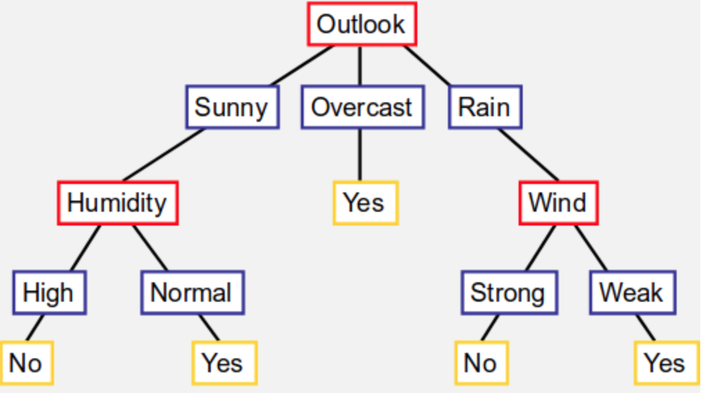

# Alberi di decisione 

Partiamo subito con un esempio:

Voglio decidere se giocare o no a tennis, creo albero di decisione che ci dice, partendo da una feature del problema scendendo poi nel caso particolare, se posso o meno giocare a tennis oggi. Dato l’albero sopra, se fuori sembra nuvoloso sicuramente gioco, se c’è il sole e umidità normale gioco, se l’umidità è alta non mi conviene e quindi non gioco; stesso concetto se il tempo sembra piovoso. Il cammino che porta dalla radice (prima feature analizzata) a una singola foglia (decisione) possiamo vederlo come un congiunzione di particolari valori delle feature, il quale mi permetterà di capire se andare o meno a tennis. Posso rappresentare anche le disgiunzioni: posso andare a giocare se è nuvoloso OR (se piove AND il vento è debole). Possiamo vedere i cammini presenti nell’albero come risultato dell’analisi del training set in nostro possesso.